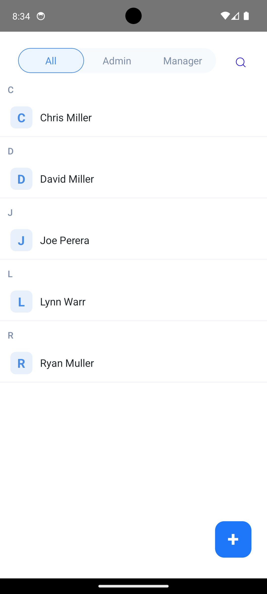
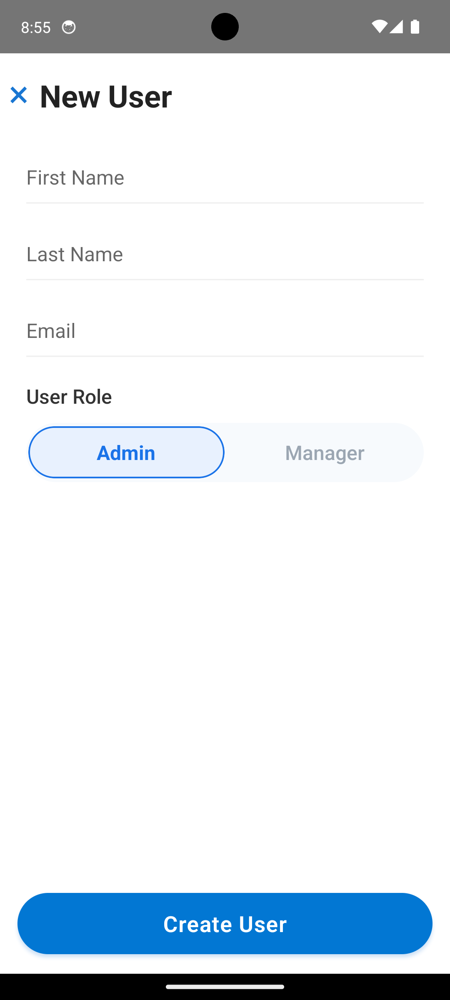

# UserDetails_Zeller

## A modern React Native app for robust user management.

This project demonstrates scalable TypeScript architecture, clean UI, offline-first sync, and test-driven development—built especially for the Zeller coding challenge.

## ✨ Features

- **User List Management:** Display, filter, and manage user records effortlessly.
- **GraphQL Integration:** Syncs with the provided listZellerCustomers query for live data.
- **Offline-Ready:** Users and updates are persisted locally using SQLite, for seamless offline experience.
- **Full CRUD:** Add, edit and delete users locally—no network mutation required.
- **Field Validation:** Names allow only letters & spaces (max 50 chars). Emails validated.
- **User Roles:** Easily switch and filter users as Admin or Manager.
- **Modern UI:** Responsive design, animated tabs, and interactive forms.
- **Cross-Platform:** Runs smoothly on both iOS and Android.
- **Tested:** Covered with unit/integration tests for confidence and maintainability.


## 🚀 Demo

Easy, intuitive, mobile-first form for creating users.

## 📐 Architecture

- **Layered Modular Architecture:**

The app separates UI components, screens, business logic, data management, and persistence for clarity and  maintainability.

-**Data Flow:**

- Fetches user data from a GraphQL API.
- Persists it to a local SQLite database for offline access.
- UI renders always from the database, not the network.
- All user creation/edit/removal is done locally, with validation at the form level.

- **Navigation:**

Uses React Navigation stack and animated pager for switching between admin/manager lists.

- **Testing:**
Code is covered by Jest and React Native Testing Library.

## Key Technologies:

- **React Native** (TypeScript)
- **GraphQL** via Apollo Client
- **SQLite** for offline persistence
- **React Navigation** (Stack & PagerView)
- **Jest & React Native Testing Library** for tests

> **Modular file structure: screens, db, graphql, components, types, tests.**

## 📦 Getting Started

### bash

```sh
# 1. Clone and enter the project
git clone https://github.com/vaibhav164/UserDetails_Zeller.git
cd UserDetails_Zeller

# 2. Install JS dependencies
yarn install         # or npm install

# 3. Start Metro bundler
yarn start           # or npm start

# 4. Run on Android
yarn android

# 5. Run on iOS (first-time: cd ios && pod install)
yarn ios

```

> **Need help?** See [React Native Environment Setup](https://reactnative.dev/docs/environment-setup).

## 🛠 Usage Guide

- **Browse Users:** View, filter by Admin/Manager, or search by name.
- **Add User:** Tap "Create User", fill out the form, pick a role, and submit.
- **Edit/Delete:** (UI supports local record manipulation)
- **Pull to Refresh:** Get the latest user data (when online).

## 🧑‍💻 Project Structure

```sh
/src
  /Components    // Reusable UI elements
  /GraphQl       // All queries, mutations
  /LocalDB       // SQLite integration, db utils
  /Navigation    // Navigator for Screens (Home, AddUser, etc.)
  /screens       // App screens (Home, AddUser, etc.)
  /types         // Shared TypeScript types & interfaces
  /utils         // utils files like image or constant files
  /tests         // Jest/RTL test suites
App.tsx          // entrypoint
```

## 🧪 Tests & Quality

```sh
# Run all test suites
yarn test       // entrypoint
```
- Snapshots and unit tests for components, logic, and flows
- Code linting and formatting enforced

## ✅ Challenge Requirements Checklist

- Modular, production-ready TypeScript app
- GraphQL-powered, with offline SQLite sync
- Add/Edit/Delete users, with validation
- Role filtering and real-time search
- Animated tab/pager navigation
- High code/test coverage, clean architecture

## 📸 Screenshots
User List Image:- 


Add User Image:- 



## 📄 License
#### MIT © 2025 Vaibhav

## 🙋‍♂️ Contact

For questions, reach out on [LinkedIn](https://www.linkedin.com/in/vaibhav-singh-90009714b/) or  via call **+91-(9158402302)**.

**Built with ❤️ for the Zeller Coding Challenge.**